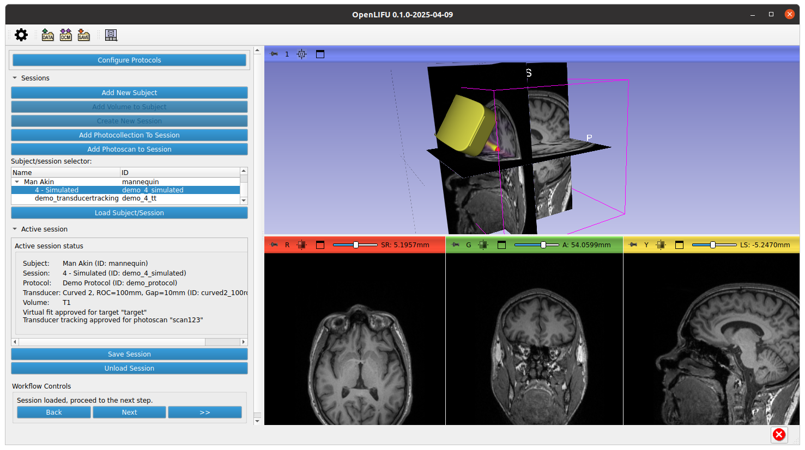

OpenLIFU by Openwater
================================

An open-source software platform for Low Intensity Focused Ultrasound (LIFU).

This desktop application provides a graphical user interface for planning and controlling OpenLIFU sonications.

_This project is in active development and may change from version to version without notice,_

## Features

* Manage users, subjects, and sessions in an [OpenLIFU database](https://openlifu.readthedocs.io/en/latest/_autosummary/openlifu.db.database.html#module-openlifu.db.database)
* Create and configure [OpenLIFU sonication protocols](https://openlifu.readthedocs.io/en/latest/_autosummary/openlifu.plan.protocol.Protocol.html#openlifu.plan.protocol.Protocol)
* Execute a clinical workflow with pre-planning and sonication stages
* Work with OpenLIFU transducers in the space of a subject MRI, specifying sonication targets and virtually fitting a transducer before a sonoication session
* Track the spatial configuration of a transducer during a sonication session via photogrammetry
* Generate transducer-specific and patient-specific sonication solutions and send them to an Openwater device.

## Setup

An NVIDIA GPU is required for a number of features.

Download the latest release for your OS from _Releases_ on the right, and follow the instructions in the release notes to install the application.

Follow [these instructions](https://github.com/OpenwaterHealth/SlicerOpenLIFU?tab=readme-ov-file#pairing-with-3d-open-water-app) to set up the system for pairing with the Openwater Android app for photo collection.

Follow [these instructions](https://github.com/OpenwaterHealth/OpenLIFU-python/tree/main?tab=readme-ov-file#installing-meshroom) to install meshroom to the system, making sure to launch the application from an environment that contains the Meshroom executable in its system path.

## Development

* [Contributing](CONTRIBUTING.md)
* [Building on Windows](BUILD_WINDOWS.md)
* [Building on Linux](BUILD_LINUX.md)

### Relation to other repositories

* [SlicerOpenLIFU](https://github.com/OpenwaterHealth/SlicerOpenLIFU) is the Slicer extension that drives this Slicer custom application. It can be used as an extension in 3D Slicer.
* [OpenLIFU-python](https://github.com/OpenwaterHealth/OpenLIFU-python) is the python library `openlifu` that contains the core algorithms and data structures that drive SlicerOpenLIFU. It can be used as a standalone python library.

### Dependency versions

The versions of Slicer and the SlicerOpenLIFU extensions that this application is based upon are determined by `GIT_TAG`s in the top-level `CMakeLists.txt`.
The version of the python package `openlifu` that is used by this application is determined by the SlicerOpenLIFU version.
So, in order to update the `openlifu` that is used:
- Update `openlifu` in the python requirements file of SlicerOpenLIFU
- Update the SlicerOpenLIFU `GIT_TAG` here in OpenLIFU-app

